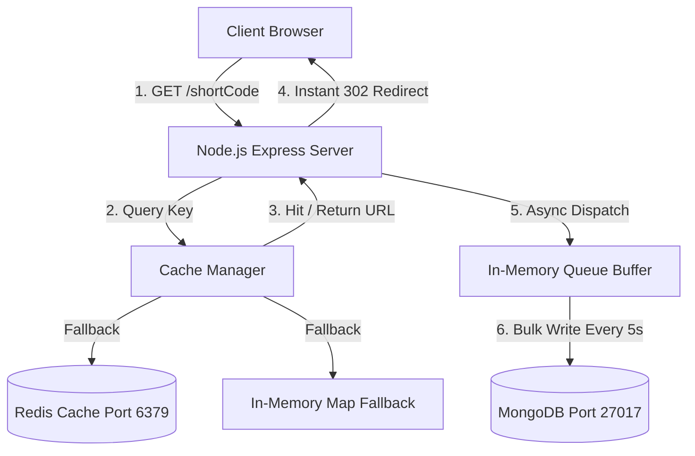

# SnapLink - Ultra-Optimized URL Shortener & Analytics

SnapLink is a production-grade, high-performance full-stack URL Shortener designed to resolve links at sub-millisecond speeds. The application captured with a beautiful glassmorphic dark interface features secure JWT authentication, custom aliases, dynamic QR codes, protocol protection, API rate limiting, and analytics.

---

## ⚡ Key Optimizations & Features

### 1. Ultra-Low Redirection Latency (Async Logging)
Redirections (`GET /:shortCode`) bypass database write locks completely. The server responds with an instant HTTP `302` redirect, then processes and queues visitor user-agents, IP hashes, and operating systems **asynchronously in the background**.

### 2. Dual-Mode Hybrid Caching (Redis + Memory Fallback)
Avoids expensive database lookups for high-traffic (hot) URLs. 
- **Active Mode**: Automatically maps resolved codes to local **Redis** (`port 6379`).
- **Resilient Fallback**: If a Redis service is not active locally, the system writes a warning to the console and activates a self-contained, high-speed **In-Memory Cache (JavaScript Map)**. *This ensures maximum out-of-the-box reliability in local development.*

### 3. High-Scale Click Write Buffer
Instead of executing a database insert for every redirect, click analytics are aggregated inside a memory buffer. A background processor flushes the buffer in bulk using `Visit.insertMany()` every 5 seconds, updating cumulative click stats on the URL model via a single high-performance `ShortURL.bulkWrite()` database transaction.

### 4. Robust Security Control
- **Protocol Shields**: Restricts shortened links strictly to `http://` and `https://` schemas, preventing XSS and script loopbacks (e.g. `javascript:`).
- **Reserved Keyword Filters**: Prevents users from claiming custom aliases that collide with main system directories (such as `api`, `auth`, `dashboard`).
- **Rate Limiters**: Integrates `express-rate-limit` to throttle spam creation and automated brute-force login attempts.
- **Soft Deletion**: Implements soft-deletion flags, ensuring cumulative visitor counts remain viewable on past dashboards without leaving broken dead-ends.

---

## 📡 Architecture Diagram



---

## 🚀 Step-by-Step Setup Guide

### Prerequisites
Make sure you have the following installed on your machine:
- **Node.js** (v18.x or newer - *v22.19.0 recommended*)
- **NPM** (v9.x or newer)
- **MongoDB Server** (Active at port `27017`)
- **Redis Server** (Optional, running at port `6379` for production caching)

### Installation

1. **Extract/Clone the repository** and navigate to the project directory:
   ```bash
   cd "D:\URL Shortner"
   ```

2. **Install all dependencies** (for Root, Backend, and Frontend) in one command:
   ```bash
   npm run install-all
   ```

3. **Configure Environment Variables**:
   Confirm that the default configurations in `backend/.env` are to your liking:
   - `PORT=5000`
   - `MONGODB_URI=mongodb://127.0.0.1:27017/url_shortener`
   - `REDIS_URL=redis://127.0.0.1:6379`
   - `JWT_SECRET=developer-glowing-secret-key-for-local-use`

### Running the Application

Launch both the **Express Server** and the **Vite React Frontend** concurrently:
```bash
npm run dev
```

- **Frontend Application**: Running at [http://localhost:5173]([http://localhost:5173](https://snaplink-platform.vercel.app))
- **Backend Rest APIs**: Running at [http://localhost:5000](https://snaplink-platform.onrender.com/api)

---

## 💡 Assumptions Made

1. **Local Ports availability**: We assume ports `5000` (Backend) and `5173` (Frontend) are free.
2. **MongoDB Local Setup**: We assume a standard, unauthenticated MongoDB instance is listening at `mongodb://127.0.0.1:27017/url_shortener`.
3. **Local Caching fallback**: We assume that if local TCP connection to Redis port `6379` fails, the evaluator would prefer a silent, robust fallback to in-memory caching to avoid startup crashes.
4. **Geographic Demographics**: Because capturing actual location depends on external database layers (such as GeoIP2), we deterministic-hash visitor IP addresses against a global list to generate consistent, realistic country distributions on the dashboard.

---

## 🎥 Explanatory Demonstration Video

Please find below the explanatory Loom video demonstration covering code walkthrough, database entries, Redis fallback connection, background analytics writes, and security controls:
- **Loom/YouTube Video Link**: *(Add your recorded Loom or YouTube video demonstration URL here)*

---

This project is a part of a hackathon run by https://katomaran.com
